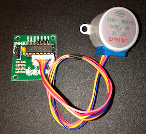

# TinyStepper Examples #

Arduino sketch examples:

## TinyStepper-Test ##

Simple test to drive a 4-phase stepper motor using simple Move() and AccelMove() functions.

## ATtiny85 Test ##

Simple test to drive a single 4-phase stepper motor using the small but mighty 8-pin ATtiny85 microprocessor.

## Laser Gimbal ##

Laser Gimbal with 2 Stepper Motors based on Thingiverse project: <https://www.thingiverse.com/thing:4561012>

Test cycles each stepper then draws a circle with the laser pointer.  Switches allow users to move the center of the circle (up/down/left/right).

* Arduino Microcontroller (e.g. Uno)
* 2 x 28BYJ-48 Stepper Motors
* 2 x ULN2003 Driver Board
* 1 x Laser (e.g. 5V 650nm 5mW Red Dot Diode Laser)
* 4 x Microswitches
* 4 x 61k Ohm Resistors (pull up resistor for switches)
* 5V Power Supply (do not power steppers with Arduino)

## Robotic Arm ##

Robotic Arm with 3 Stepper Motors based on Thingiverse project: <https://www.thingiverse.com/thing:2838859>

Test cycles each stepper and then responds to user switches (up/down) for stepper motion.

* Arduino Microcontroller (e.g. Mega2560)
* 3 x 28BYJ-48 Stepper Motors
* 3 x ULN2003 Driver Board
* 6 x Microswitches
* 6 x 61k Ohm Resistors (pull up resistor for switches)
* 5V Power Supply (do not power steppers with Arduino)
